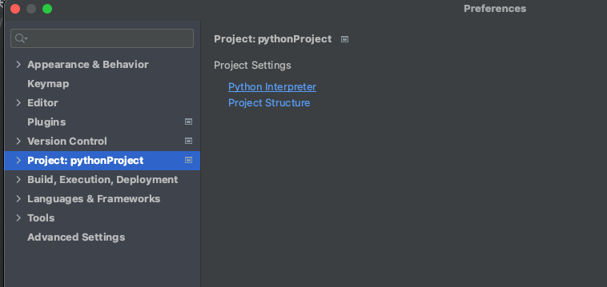

# How to use pycharm to contribute to multiple git repositories
This includes:
- Using git on different repositories, but in the same pycharm project
- Having non-shared (not tracked by git) code to test or just analyse data
- Bonus: running the code on remote servers (niagara in this case)
  
## 1. Create an empty project
a. Go in the menu bar and select File/New Project...

b. Define a remote interpreter (if you want to work remotely).  
You can also choose the name of the project. Here it will stay `pythonProject`.

c. Define the remote server (in this case, narval at compute canada).  
Notes:
 * For astro.umontreal.ca servers, use the port 5822.
 * You need to change `adb` for your own Username.

 * If the server is already defined, select an existing one.

d. You will get some messages if the connection worked. Simply click `Next`.

e. Specify the location of the remote interpreter.  
Notes:
 * I recommend to install the python environment on the server beforehand.  
 See [this tutorial](https://docs.alliancecan.ca/wiki/Python/fr#Cr.C3.A9er_et_utiliser_un_environnement_virtuel) for more info about Compute Canada environment creation.  So select `Existing` environment.
 

 
 * Trick to find the location of the environment:  
 Connect to the server on a terminal, activate the environment and type `which python`. In the example screenshot below,  you need to replace the `~` by `/home/your_user_name`
 

 
 To find the correct location, you can write it directly or browes the remote files.
 

Finally, click on create to confirm. It will check if it can find the interpreter.

Your project is created!

### Additional notes
- You can switch between interpreters at will. For example, you may want a local interpreter in case your connexion is not working. It can also be useful to be able to work on different servers. To do so, just select or add the interpreter at the bottom of the pycharm window.

- You can access you ssh remotes in the Preferences

## 2. Sync with remote

### 2.1 Update the python interpreter
To be able to run and keep files on the remote in sync, you need too specify the remote interpreter (again) and the remote project.

a. Go in Preferences, then Python interpreter

b. Choose an existing ssh interpreter (you  just created in [Step 1](#1-create-an-empty-project))

c. Then you need to re-specify the python interpreter in the remote server (same as in [Step 1](#1-create-an-empty-project))

d. And the project directory on the remote host.

### 2.2 Setup the deployment server
You need to specify (again...) which directory and server will be used to sync your project.

a. Go in the menu bar, select Tools | Deployment | Configuration

b. Select the correct server with the options you want.
 * Note that you can set the root path to your home directory. Easier for navigation.

c. Set the correct mapping (again) between your local pycharm project and the remote directory

Notes
 * You can change the name of the deployment server for clarity

 
